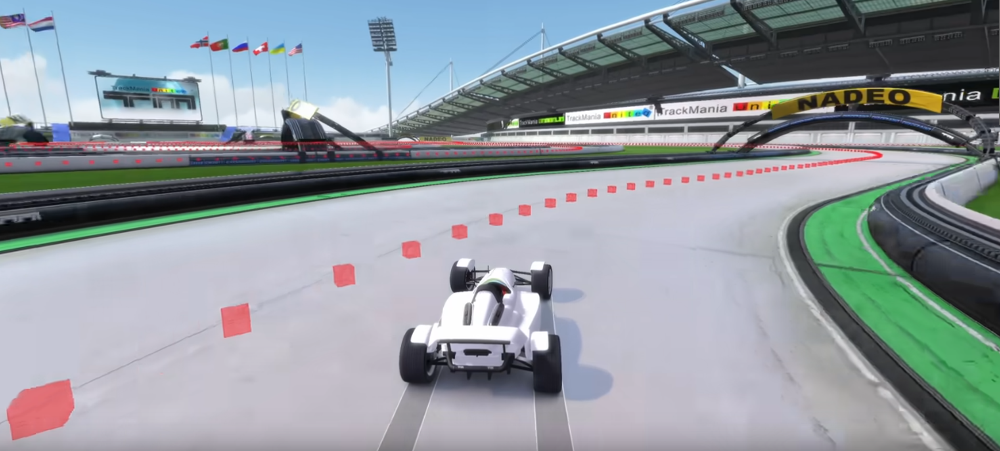

===============
Custom training
===============

In this page, it is expected that the user has successfully run :doc:`a first reference training on Hockolicious <first_training>`.

The objective is now to train the AI on another map, not preconfigured by the authors. As an exercise, we recommend setting up a simple map such as A02-Race.

Define a Reference Line
-----------------------

We define a reference trajectory along which the agent's progress is measured.

This reference trajectory **does not need to be fast**. The authors usually drive along the centerline of the map.

Use the following command to create a file ``maps/map.npy`` for your map from a replay.

.. code-block:: bash

   python scripts/tools/gbx_to_vcp.py {path_to_replay}.Replay.Gbx

Rename the file to your liking so that it is not overwritten in the future.

The authors recommend the following nomenclature: ``{map_name}_0.5m_{trajectory_description}.npy``. Trajectory description may be ``cl`` when the replay was driven on the centerline, or ``{player_name}`` if a known player's trajectory was used as reference.

.. note::
    To define the reference line, points are sampled every 50cm along the replay's trajectory. Over the course of the project, the terms "Virtual Checkpoints", "VCP", "zones" have been used to refer to these points.

Check the Reference Line
------------------------

This step is optional, but recommended. We want to visualize the reference line to check its position on the map.

Launch a game instance with the argument ``/configstring=set custom_port 8477``.

Load the map.

Run the following command:

.. code-block:: bash

    python scripts/tools/tmi2/add_vcp_as_triggers.py maps/A02-Race_0.5m_cl.npy -p 8477

.. note::
    The ``-p`` argument allows you to choose the port used to connect to the game instance. You can freely change ``8477`` to any other available port.

Edit the configuration file
---------------------------

Open ``config_files/config.py`` in a text editor. This file contains the hyperparameters that define a training run.

Find where the variable ``map_cycle`` is defined, near the bottom of the page. Read the comment that describes how a map_cycle is defined. Edit the map_cycle so that the AI only trains on A02-Race.

.. code-block:: python

    """
    In this section we define the map cycle.

    It is a list of iterators, each iterator must return tuples with the following information:
        - short map name        (string):     for logging purposes
        - map path              (string):     to automatically load the map in game.
                                              This is the same map name as the "map" command in the TMInterface console.
        - reference line path   (string):     where to find the reference line for this map
        - is_explo              (boolean):    whether the policy when running on this map should be exploratory
        - fill_buffer           (boolean):    whether the memories generated during this run should be placed in the buffer

    The map cycle may seem complex at first glance, but it provides a large amount of flexibility:
        - can train on some maps, test blindly on others
        - can train more on some maps, less on others
        - can define multiple reference lines for a given map
        - etc...

    The example below defines a simple cycle where the agent alternates between four exploratory runs on map5, and one
    evaluation run on the same map.

    map_cycle = [
        repeat(("map5", '"My Challenges/Map5.Challenge.Gbx"', "map5_0.5m_cl.npy", True, True), 4),
        repeat(("map5", '"My Challenges/Map5.Challenge.Gbx"', "map5_0.5m_cl.npy", False, True), 1),
    ]
    """

.. note::

    For those who wish to dive deeper into the project, there are many similar comments spread within the codebase explaining how the AI is trained.

Locate the variable ``global_schedule_speed``. We expect A02-Race to be slightly easier to train than ESL-Hockolicious: we can define a faster annealing for training hyperparameters.

.. code-block:: python

    global_schedule_speed = 0.8

For maps like `map5 <https://tmnf.exchange/trackshow/10460245>`_ or E03-Endurance we would typically use a global_schedule_speed close to 1.5.